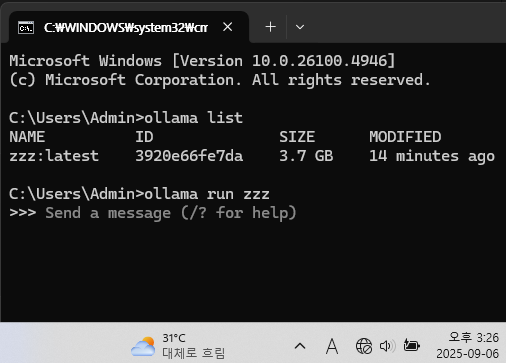
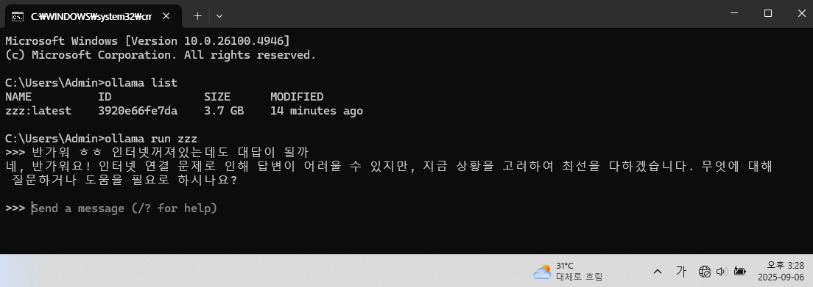

로컬 LLM + 코드 RAG 세팅 (Windows / 폐쇄망)



사진에서 볼 수 있듯, 인터넷이 안되는 상황에서 



답변을 해주는 모습. 즉, LLM이 로컬에서 돌고있는것이다.

```plaintext
이직한 회사가 내부망을 쓰는데 chatGPT를 다른 컴퓨터에서 쓰고 복붙하는 게 귀찮아서 직접 정리함.
USB → 폐쇄망 PC로 복사 후 아래 구조로 세팅.

-----------------------------------------📂 프로젝트 구조

모델이랑 설치파일은 아마 사이즈가 커서 깃에 못올릴듯.
https://huggingface.co/bartowski/Meta-Llama-3.1-8B-Instruct-GGUF?utm_source=chatgpt.com
에 들어가서 내 컴퓨터 스펙에 여유있는 모델로 다운

파이썬 다운경로도
https://www.python.org/downloads/release/python-3137/

ollama 다운경로
https://ollama.com/download


C:\llm\
 ├─ models\
 │   ├─ Meta-Llama-3.1-8B-Instruct-Q3_K_S.gguf   (개인PC용)
 │   ├─ Meta-Llama-3.1-8B-Instruct-Q5_K_M.gguf   (회사PC용)
 │   ├─ Meta-Llama-3.1-8B-Instruct-Q6_K_L.gguf   (고사양용)
 │   ├─ Modelfile-q3.txt
 │   ├─ Modelfile-q5.txt
 │   ├─ Modelfile-q3   ← 확장자 없는 파일
 │   └─ Modelfile-q5   ← 확장자 없는 파일
 │
 └─ tools\
     ├─ index_repo.py
     ├─ ask.py
     └─ agent_apply.py    (선택: diff 자동 적용기)


.py나 확장자 없는 샘플은 메모장에서 “모든 파일” 선택 → 확장자 붙여 저장해서 tools/에 넣으면 됨.

-----------------------------------------⚙️ 세팅
Modelfile 예시

C:\llm\models\Modelfile-q3.txt

FROM C:\llm\models\Meta-Llama-3.1-8B-Instruct-Q3_K_S.gguf
PARAMETER temperature 0.2
PARAMETER num_ctx 2048
PARAMETER num_gpu_layers 0


→ 저장 시 확장자 제거 → Modelfile-q3

C:\llm\models\Modelfile-q5.txt

FROM C:\llm\models\Meta-Llama-3.1-8B-Instruct-Q5_K_M.gguf
PARAMETER temperature 0.2
PARAMETER num_ctx 4096
PARAMETER num_gpu_layers 0


→ 저장 시 확장자 제거 → Modelfile-q5

설치 순서

Ollama 설치

OllamaSetup.exe 실행 (기본값 설치)

Python 설치

python-3.13.x-amd64.exe 실행

반드시 "Add python.exe to PATH" 체크 후 설치

설치 확인

ollama -v
python --version

-----------------------------------------🐏 모델 등록
ollama create <이름> -f <모델파일경로>


개인PC (RAM 7~8GB):

ollama create my-llama31 -f C:\llm\models\Modelfile-q3


회사PC (RAM 16~32GB):

ollama create my-llama31-q5 -f C:\llm\models\Modelfile-q5

🗑 모델 삭제
ollama list


출력 예시:

NAME             ID              SIZE    MODIFIED
my-llama31       3d82f19f…       3.4 GB  2025-09-06 11:20:00
my-llama31-q5    b91a01c2…       5.7 GB  2025-09-06 09:45:00


특정 모델 삭제:

ollama rm my-llama31

-----------------------------------------🚀 실행 방법 1
1) 그냥 실행 (빠름)
ollama run my-llama31


-----------------------------------------🚀 실행 방법 2
2) 프로젝트 기반 RAG 실행 (엄청느림....ㅠㅠ)

서버 실행

ollama serve


코드 인덱싱

cd /d C:\llm\tools
python index_repo.py --root "C:\경로\내프로젝트"


→ tools/code_index.json 생성

질문하기 (CMD: ^ 로 줄바꿈)

python ask.py --q "안녕? 내 프로젝트의 @@@에 대해 알려줘" ^
  --api "http://127.0.0.1:11434/v1/chat/completions" ^
  --model "my-llama31"

질문하기 (PowerShell: 백틱 ` 로 줄바꿈)

python ask.py --q "안녕? 내 프로젝트의 @@@에 대해 알려줘" `
  --api "http://127.0.0.1:11434/v1/chat/completions" `
  --model "my-llama31"

-----------------------------------------🛠 트러블슈팅

오류:

Error: listen tcp 127.0.0.1:11434: bind: Only one usage of each socket address...
→ 이미 실행 중. 프로세스 종료 후 ollama serve 다시 시작.

-----------------------------------------📝 기록사항

모델 특성 바꾸려면 ask.txt나 index_repo.txt 참고 → 수정 후 .py로 변환 → tools/에 넣고 실행

(2025/09/06) Q3 모델 기준 메모리 90% 사용. 그래도 코드 읽고 답변 주는 거 꽤 괜찮음 😆

```
